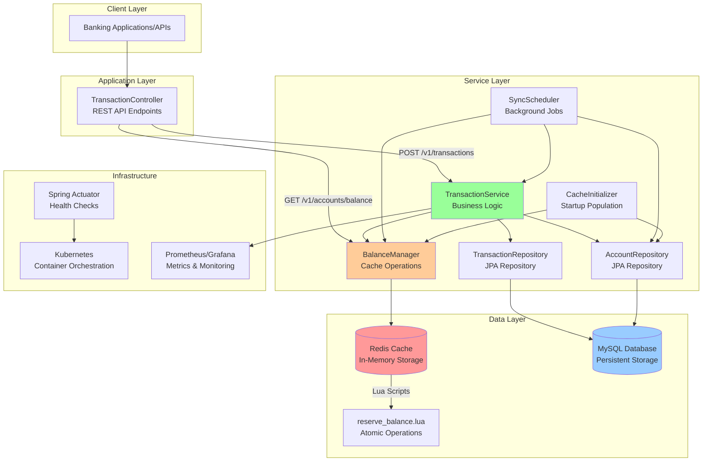
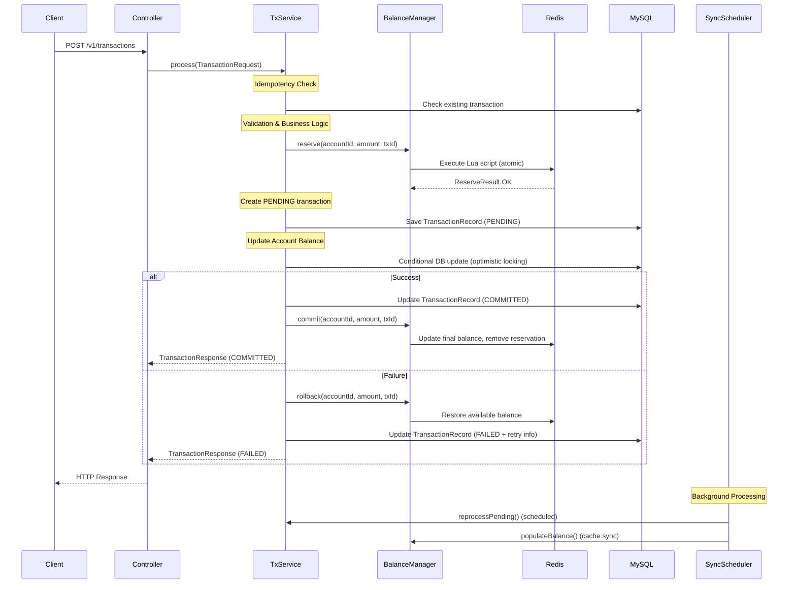
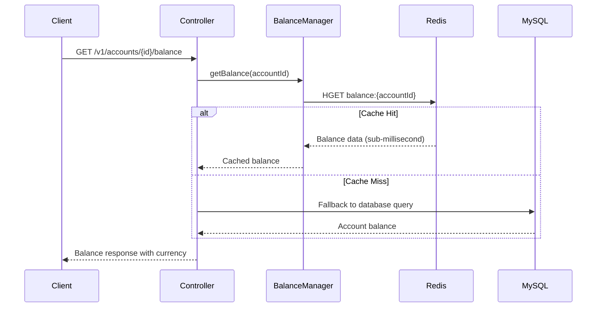
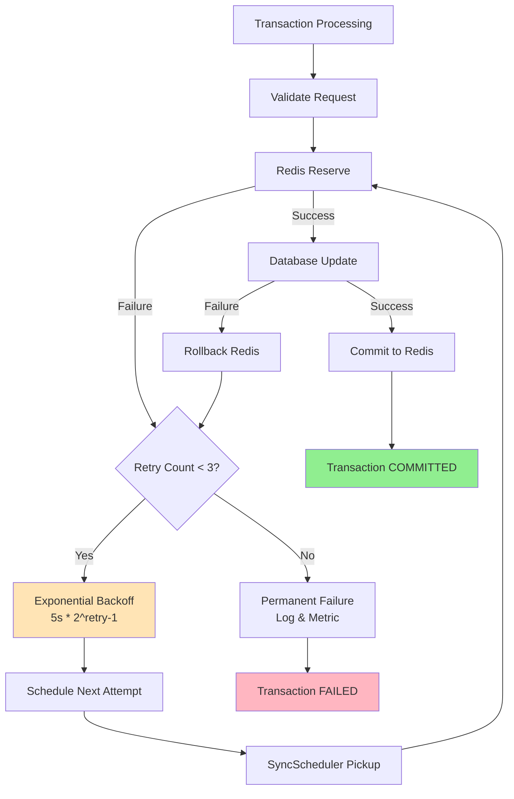
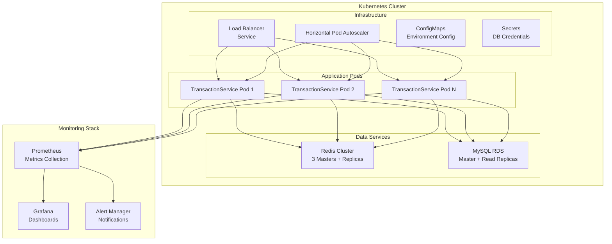

# TransactionServicePilot - Technical Design Diagram

## System Architecture Overview



## Data Flow Diagrams

### 1. Transaction Processing Flow



### 2. Balance Query Flow



### 3. Retry and Recovery Flow



## Component Details

### Core Components

| Component | Responsibility | Technology |
|-----------|---------------|------------|
| **TransactionController** | REST API endpoints, request validation | Spring Boot REST |
| **TransactionService** | Business logic, transaction orchestration | Spring Service |
| **BalanceManager** | Redis cache operations, atomic reservations | Redis + Lua Scripts |
| **SyncScheduler** | Background sync, retry processing | Spring Scheduler |
| **AccountRepository** | Account persistence, optimistic locking | Spring Data JPA |
| **TransactionRepository** | Transaction persistence, audit trail | Spring Data JPA |

### Data Models

#### Account Entity
```
- id (Primary Key)
- accountNumber (Unique)
- balance (DECIMAL 19,4)
- availableBalance (DECIMAL 19,4)
- currency
- version (Optimistic Locking)
- timestamps
```

#### Transaction Entity
```
- id (Primary Key)
- txId (Business ID, Unique)
- sourceAccountId / destinationAccountId
- type (DEBIT/CREDIT/TRANSFER)
- amount (DECIMAL 19,4)
- status (PENDING/COMMITTED/FAILED)
- retryCount, nextAttemptAt
- timestamps, error details
```

#### Redis Data Structure
```
balance:{accountId} = {
  "balance": "cents_as_string",
  "available": "cents_as_string", 
  "currency": "USD"
}

reservation:{txId} = {
  "txId": "transaction_id",
  "amount_cents": "amount",
  "balanceKey": "balance:{accountId}"
} (TTL: 30 seconds)
```

## Key Design Patterns

### 1. **Optimistic Locking**
- JPA `@Version` annotation on Account entity
- Prevents lost updates in concurrent scenarios
- Automatic retry with exponential backoff

### 2. **Cache-Aside Pattern**
- Redis as primary read cache for balances
- Database as source of truth
- Graceful degradation when cache unavailable

### 3. **Saga Pattern (Simplified)**
- Two-phase approach: Reserve → Commit/Rollback
- Atomic Redis operations via Lua scripts
- Compensation actions for failure scenarios

### 4. **Circuit Breaker (Implicit)**
- Fallback to database when Redis fails
- Graceful degradation maintains availability

## Performance Characteristics

| Metric | Target | Implementation |
|--------|--------|----------------|
| **Balance Query Latency** | < 10ms | Redis cache (sub-millisecond) |
| **Transaction Throughput** | 10,000 TPS | Async processing + caching |
| **Availability** | 99.9% | Kubernetes + graceful degradation |
| **Consistency** | ACID | Database transactions + optimistic locking |

## Deployment Architecture



## Error Handling Strategy

### Retry Policy
- **Transient Failures**: Retry up to 3 times with exponential backoff (5s, 10s, 20s)
- **Permanent Failures**: Log error, emit metrics, no further retries
- **Circuit Breaking**: Fallback to database when Redis unavailable

### Monitoring & Alerting
- Transaction throughput and latency metrics
- Error rate and retry count tracking
- Cache hit/miss ratios
- Database connection pool health
- Kubernetes pod health and resource usage

This design ensures high performance, reliability, and scalability while maintaining strict consistency requirements for financial transactions.